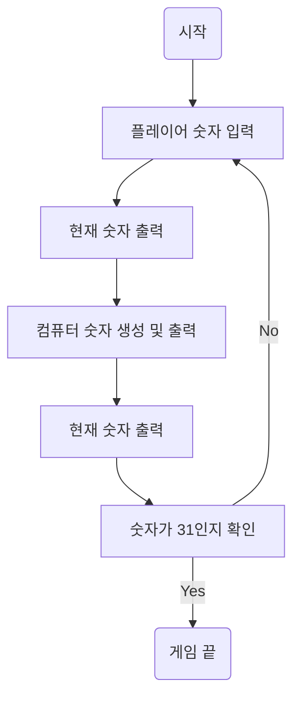

# sujinyoon

```mermaid
flowchart TB
    Start(시작) --> Player_Input[플레이어 숫자 입력]
    Player_Input --> Display_PNumber["현재 숫자 출력"]
    Display_PNumber --> Computer_Play[컴퓨터 숫자 생성 및 출력]
    Computer_Play --> Display_CNumber["현재 숫자 출력"]
    Display_CNumber --> Check["숫자가 31인지 확인"]
    Check -- "No" --> Player_Input
    Check -- "Yes" --> End(게임 끝)
```
